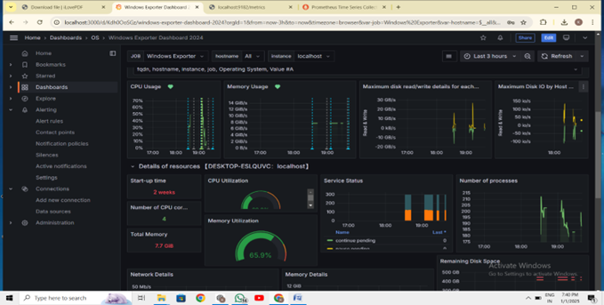

# Real-Time System Process Graphical Dashboard

A graphical dashboard project built to monitor system processes in real-time. The tool dynamically displays active processes with details like PID, status, CPU usage, and memory consumption.

## 🔧 Features
- Real-time process tracking
- Dynamic GUI updates when a process is created, terminated, or changed
- Alerts for high CPU and memory usage (custom thresholds)
- Graphical representation of CPU and memory usage
- Dashboard with process metadata

## 🛠️ Technologies Used
- **Prometheus** – System metrics exporter
- **Grafana** – For real-time dashboard visualization
- **Windows Explorer** – Process interface on Windows

## 📸 Screenshot

## ⚙️ How to Run
1. Install Prometheus and configure `prometheus.yml`
2. Export system metrics using node_exporter (or custom exporter if applicable)
3. Import the provided Grafana dashboard JSON file
4. Launch Grafana and connect to Prometheus
5. View real-time updates on the dashboard

## 📁 File Structure
- `prometheus.yml` – Prometheus config file
- `grafana_dashboard.json` – Grafana dashboard export
- `images/` – Screenshots or demo images
- `setup_instructions.txt` – Step-by-step installation instructions

## 👩‍💻 Developer
**Kavana B M**  
Project for Operating Systems course  

